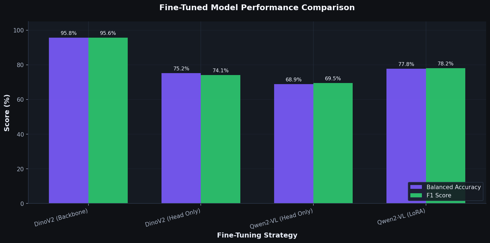
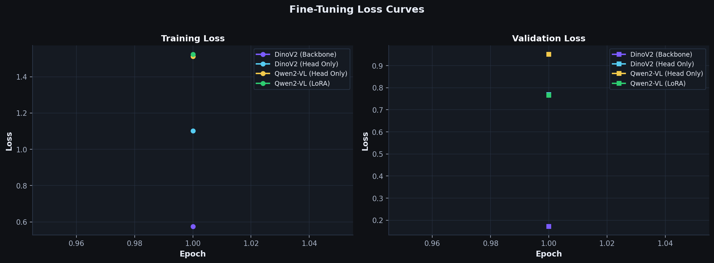
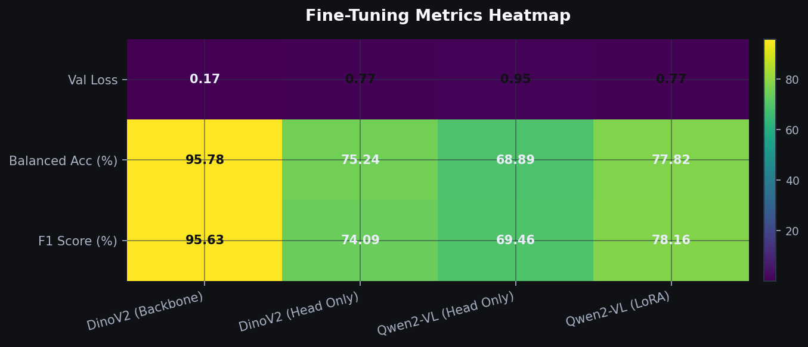
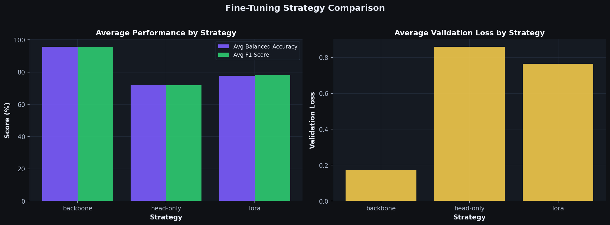

<!-- Auto-generated by finetuning_stats_for_docs.py -->

## Fine-Tuning Results

{: .highlight }
> **Best Model**: DinoV2 (Backbone) achieved **95.78%** balanced accuracy and **95.63%** F1 score.

### Model Comparison

### Performance Summary

| Model | Strategy | Balanced Acc | F1 Score | Val Loss |
|-------|----------|--------------|----------|----------|
| DinoV2 (Backbone) | backbone | 95.78% | 95.63% | 0.1720 |
| DinoV2 (Head Only) | head-only | 75.24% | 74.09% | 0.7692 |
| Qwen2-VL (Head Only) | head-only | 68.89% | 69.46% | 0.9517 |
| Qwen2-VL (LoRA) | lora | 77.82% | 78.16% | 0.7651 |

### Training Curves

### Metrics Heatmap

### Strategy Comparison

{: .note }
> **Technical Details**
>
> - **Models evaluated**: 4
> - **Best by accuracy**: DinoV2 (Backbone)
> - **Best by F1 score**: DinoV2 (Backbone)
> - **Best by val loss**: DinoV2 (Backbone)
