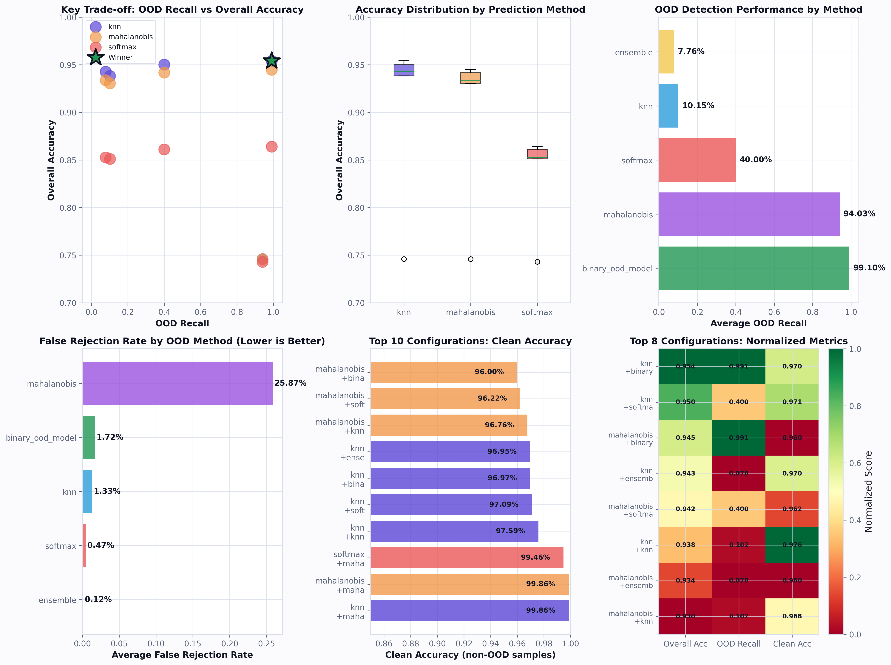

## Tile Classification & Board Reconstruction

After obtaining tile embeddings from DINOv2-small, we proceed to classify each tile and reconstruct the full board state. We experimented with various architectures including KNN, Mahalanobis distance-based, and softmax-based classifiers.

**Ultimately, KNN paired with a binary OOD guard achieved the best results**: **95.41% overall accuracy**, **99.10% OOD recall**, and **96.97% clean accuracy** on valid chess pieces.

## OOD Detection Strategy

For out-of-distribution (OOD) detection, we implemented two complementary mechanisms:

1. **"Unknown" class in the multiclass classifier** — trained during fine-tuning to explicitly recognize OOD tiles
2. **Dedicated binary OOD model** — acts as a safety guard with high-recall anomaly detection

During preprocessing, any frames containing OOD elements (hands, foreign objects) were specifically tagged to train the model to recognize and separate these from regular chessboard pieces.

## Overview of the Tile Classifier

The `FENClassifier` is a per-tile classifier that predicts the class of each of the 64 board tiles independently using a **global embedding database**. It works with any embedding model implementing the `EmbeddingModel` interface (e.g., DINOv2-small or Qwen2-VL).

Rather than maintaining 64 separate KNN structures, we use a unified **global memory bank**:

- **Global embeddings** (`self.globalembeddings`): tens of thousands of tile embeddings from all board positions and game states
- **Global labels** (`self.globallabels`): the corresponding piece class for each embedding
- **Normalized index** (`self.normalizedembeddings` / `self.normalizedlabels`): L2-normalized vectors for efficient cosine-similarity search
- **Class statistics** (`self.globalmeans` / `self.globalcovinv`): per-class means and shared inverse covariance for Mahalanobis distance

{: .decision }
**Why a global index?** A single unified index is simpler than 64 per-tile structures, reduces memory overhead, and allows seamless swapping between prediction heads (KNN, Mahalanobis, softmax, binary OOD) while sharing the same embedding store.

## Binary OOD Classifier

### Architecture & Training

We trained a **dedicated binary classifier** on a fine-tuned **DINOv2-small backbone** to answer:

> Is this tile **in-distribution** (chess piece / empty) or **out-of-distribution** (hand / foreign object)?

**Model Structure**:
- **Backbone**: DINOv2-small fine-tuned end-to-end
- **Classification Head**:
  - Linear(384 → 192)
  - ReLU + Dropout(0.3)
  - Linear(192 → 2) — logits for `[ID, OOD]`

**Training Strategy**:
- **Loss**: Weighted cross-entropy with heavy OOD upweighting (~8.0) to prioritize recall
- **Optimization**: AdamW with separate learning rates (slow backbone, faster head)
- **Selection**: Epoch 3 provides best trade-off; checkpoint: `binary_ood_dino_small_epoch3.pt`

{: .decision }
**Why dedicated binary?** KNN-based OOD heuristics struggled with false positives and false negatives. A dedicated binary guard with asymmetric loss ensures high recall on anomalies while minimizing incorrectly rejected valid pieces.

### Integration & Deployment

The binary model attaches to `FENClassifier` via `set_binary_model()`:
1. Loads fine-tuned backbone and binary head from checkpoint
2. Stores preprocessing transform for inference
3. Registers as OOD decision mode: `oodmethod="binary_ood_model"`

At inference, each tile is routed through the binary guard **alongside** KNN/softmax multiclass predictions, providing robust defense against distribution shift.

## KNN Tile Classification

### Global KNN Design

For main multiclass tile prediction, we use a **K-Nearest Neighbors (KNN) classifier** over the global embedding memory. The design combines several practical decisions:

- **Single global index** instead of 64 per-tile indices: all embeddings stacked into `self.globalembeddings` and labels into `self.globallabels`
- **Normalization and cosine similarity**:
  - Embeddings stored as L2-normalized vectors
  - Query embeddings normalized and compared via cosine similarity
  - Similarity metric outperforms raw distance empirically

**KNN Hyperparameters**:
- `knn_k = 5`: neighborhood size
- `knn_similarity_threshold`: similarity cutoff for OOD decisions
- `knn_distance_threshold`: distance-based OOD cutoff (derived from similarity statistics)
- `knn_MIN_CONSENSUS`: minimum neighbor agreement for vote-based OOD checks

These thresholds are calibrated on validation data via percentile-based heuristics and stored as part of model state for inference without recalibration.

### KNN Prediction Variants

We experimented with **two equivalent implementations** for similarity/distance computation:

**1. Cosine-Similarity KNN** (normalized embeddings)
- Normalize database and query embeddings
- Compute cosine similarity matrix
- Select Top-K neighbors by similarity
- Use average similarity as confidence score
- Apply neighbor labels for class prediction and OOD heuristics

**2. Euclidean-Distance KNN** (with normalization)
- Normalize embeddings, convert similarity to distance: $d \approx \sqrt{2(1 - \text{sim})}$
- Select neighbors by smallest distance
- Apply distance thresholds to flag OOD tiles

**Empirically**, both methods performed similarly, but **normalization consistently outperformed raw unnormalized distances**. In practice, we slightly relax the strict nearest-neighbor decision to allow margin around the best neighbor, improving robustness.

## Alternative OOD Strategies in KNN Space

Beyond the dedicated binary model, we implemented **KNN-based OOD heuristics**:

| Strategy | Decision Rule |
|---|---|
| **Similarity threshold** | If avg cosine similarity of Top-K neighbors < `knn_similarity_threshold`, flag OOD |
| **Distance threshold** | If K-th neighbor's distance > `knn_distance_threshold`, flag OOD |
| **Vote-based threshold** | If winning class < `knn_MIN_CONSENSUS` fraction of votes, flag OOD (ambiguous neighborhood) |

**Final OOD decision**: Majority-style rule — if **any** condition fails, tile is flagged OOD.

{: .warning }
**Empirical Finding**: None of these KNN-based OOD criteria, individually or in combination, achieved satisfactory OOD performance. They were either too conservative (high false rejection) or too permissive (missed OOD tiles). This motivated our **dedicated binary OOD model** and **"unknown" class** during fine-tuning.

## Mahalanobis Distance Classifier

### Global Class Statistics

As an alternative to KNN, we implemented **Mahalanobis-distance-based classification** over the global embedding memory. We compute:

- **Class means** (`self.globalmeans`): one mean vector per class
- **Shared covariance** (`self.globalcovinv`): global covariance matrix and its inverse
  - Computed over centered embeddings across all classes
  - Regularized with diagonal jitter for numerical stability
  - Empirically estimated per-class distance distribution
  - Global threshold (99th percentile) to reject outliers

### Mahalanobis Prediction

The `predict_mahalanobis` method:
1. Computes Mahalanobis distance to every class mean using shared covariance
2. Predicts closest class (minimum distance)
3. Generates confidence score based on distance
4. Flags OOD if distance exceeds `mahalthreshold`

{: .highlight }
**Empirical Result**: Although theoretically appealing (class-conditional Gaussian in embedding space), Mahalanobis **performed worse than KNN** in both clean accuracy and OOD behavior. It remains available as a secondary option rather than the default.

## Softmax Head and Temperature Scaling

For completeness, `FENClassifier` supports a **softmax-based multiclass head** trained during fine-tuning:

- Architecture matches training definition from `finetune.py`, reconstructed via `load_classifier_head`
- Temperature parameter `softmax_temperature` and threshold `softmax_threshold` calibrate probabilities and detect low-confidence (OOD) predictions
- Grid search over temperatures/thresholds on validation set, optimizing OOD recall vs false rejection

**Empirical Result**: Softmax-only OOD mode complements KNN and Mahalanobis baselines but **did not match the robustness of the binary guard** when evaluated on our dataset.

## Board Reconstruction

Given per-tile predictions, we reconstruct the full 8×8 board through these steps:

### 1. Per-Tile Inference

- Input board image sliced into 64 tiles using same preprocessing as training
- Each tile embedded by chosen backbone (fine-tuned DINOv2-small or Qwen)
- `FENClassifier` predicts class label and OOD flag per tile using:
  - **Prediction method**: KNN, softmax, or Mahalanobis
  - **OOD method**: binary guard, KNN, Mahalanobis, or ensemble

### 2. Internal to FEN Mapping

- Internal class IDs (including OOD class) mapped to canonical piece indices
- Finally converted to FEN symbols for downstream tasks

### 3. Handling OOD Tiles

- Tiles flagged as OOD (via binary model or heuristics) mapped to "unknown" / non-piece code
- Visualized distinctly on board output

The final **8×8 board tensor** is used for visualization and downstream evaluation (accuracy, error analysis, benchmarks).

## Performance Overview

The classifier's performance varies by prediction method and OOD strategy. Here's a comprehensive comparison:

**Key Findings**:

| Configuration | Overall Acc | OOD Recall | False Rejection | Clean Acc |
|---|---|---|---|---|
| **KNN + Binary OOD** | **95.41%** | **99.10%** | **1.72%** | **96.97%** |
| KNN + Softmax OOD | 95.02% | 40.00% | 0.47% | 97.09% |
| KNN + KNN OOD | 93.84% | 10.15% | 1.33% | 97.59% |
| Softmax + Binary OOD | 86.40% | 99.10% | 1.72% | 87.53% |

{: .highlight }
**Winner: KNN + Binary OOD Guard** achieves the best balance of overall accuracy, OOD recall, and clean accuracy on valid pieces. Mahalanobis-based methods lag significantly due to poor Gaussian assumptions in high-dimensional embedding space.

## Summary & Design Rationale

Our tile classification pipeline combines:

1. **Global KNN classifier** over fine-tuned embeddings as the main per-tile predictor
2. **Binary OOD DINOv2-small model** (epoch 3 checkpoint) as a dedicated safety guard
3. Multiple OOD strategies (similarity, distance, vote-based) explored but found insufficient alone
4. Alternative heads (Mahalanobis, softmax) available but underperform KNN + binary-guard

This modular design allows us to:
- ✓ Swap embedding backbones independently
- ✓ Mix-and-match prediction and OOD methods
- ✓ Maintain a unified `FENClassifier` API for tile and board inference
- ✓ Iterate on components without refactoring the entire system

The result is a **robust, composable, and production-ready** classifier that handles both clean chess tiles and out-of-distribution anomalies with high fidelity.

